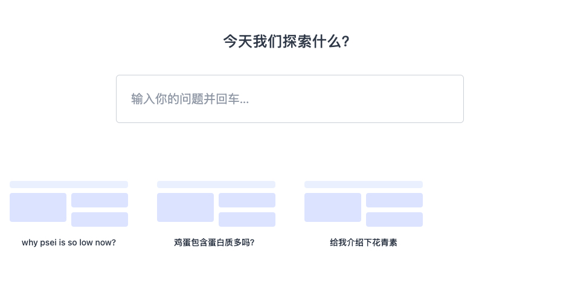

<div align="center">
  <h1>AITU 知识图谱对话平台</h1>
  <p>交互式多轮问答 + 节点式知识延展 + LLM 语义补全。前端 React / Vite / Tailwind，后端 FastAPI + LangChain + SiliconFlow。</p>
</div>

<div align="center">
  <!-- 项目截图 -->
  
  
  <br/>
  <em>界面示例：左侧多轮问答节点，右侧知识延展分支。</em>
</div>

## ✨ 特性 (Features)

- 🚀 前端：React + TypeScript + Vite + TailwindCSS，组件化快速迭代
- 🧠 后端：FastAPI + LangChain，可接入 SiliconFlow / OpenAI 兼容模型
- 🗂️ 多轮上下文：每个节点保存独立 Q&A 序列 (context)
- 🌿 分支探索：对节点内选中文本进行“知识延伸”自动生成分支节点
- 🖍️ 文本高亮：记录并持久化用户选区偏移 (offsets)；支持作用域 (question/answer + qaIndex)
- 🧩 Markdown + 数学：remark / rehype + KaTeX 渲染公式与 GFM
- 🔗 节点连接：React Flow 生成知识流谱系
- 🧪 易扩展：新增模型 / 新增后端路由只需改动集中文件

## 🏗️ 架构 (Architecture)

```
frontend/ (React + Vite)
  src/
    components/
      KnowledgeGraph.tsx      # 主交互：节点/边、选区、上下文管理
      Nodes.tsx               # Markdown 节点渲染 & 高亮
      ChatBox.tsx             # 底部输入 & 提交
      QuestionLabel.tsx       # 问题标签样式
    utils/markdownHighlightUtils.tsx  # 选区偏移计算 & 高亮 rehype 插件
    markdown-plugins/rehypeWrapQuestion.ts # 自定义包裹处理
  service.ts                  # 与后端 /ask 等接口通信

backend/ (FastAPI)
  main.py                     # 应用入口 / CORS / 路由注册
  chat.py                     # /ask 逻辑（示例）
  llm/model.py                # LangChain & SiliconFlow 模型工厂
  llm/.env                    # API Key (本地，不提交)
```

数据流简述：
1. 用户在某节点输入问题 → 若包含选区“知识延伸”则创建分支节点 → 写入 context 占位 (question, llmResponse: null)
2. 前端调用后端 `/ask` → LLM 回复 → 更新目标节点 context 最后一条 → 渲染 Markdown / 高亮
3. 用户选中文本 → 计算 offsets → 临时显示“知识延伸”工具条 → 点击生成新分支节点 & 保存高亮


## Docker 部署

```bash
docker compose build
docker compose up -d
```

## 🔌 后端环境 (Backend Setup)

支持 `pdm`（推荐）或 `pip`。

### 1. 进入目录
```bash
cd backend
```

### 2A. 使用 PDM
```bash
pdm install
pdm run uvicorn main:app --reload
```

### 2B. 或使用 venv + pip
```bash
python -m venv .venv
source .venv/bin/activate  # Windows: .venv\Scripts\activate
pip install -r requirements.txt
uvicorn main:app --reload
```

### 3. 配置环境变量 `backend/llm/.env`
```
SILICONFLOW_API_KEY=你的Key
OPENAI_API_KEY=可选
MODEL_NAME=默认模型(可选)
```

### 4. API 主要路由
| 方法 | 路径 | 描述 |
|------|------|------|
| POST | /ask | 提交问题，返回 LLM 回答 |

> 如需新增：在 `backend/` 新建 `xxx.py`，创建 `APIRouter`，在 `main.py` 中 `include_router`。

## 💻 前端运行 (Frontend Setup)

根目录：
```bash
yarn install
yarn dev        # 启动开发 (http://localhost:5173)
yarn build      # 生产构建
yarn preview    # 预览构建
```

Tailwind 已配置 (`tailwind.config.js`)；全局样式入口 `src/index.css`。

## 🧠 关键逻辑说明

### 1. 节点上下文 (Context)
每个节点 `data.context` 为数组：`[{ question, llmResponse }]` 按时间顺序追加。提交时先插入占位，再填充回答。

### 2. 选区高亮 (Selection Highlight)
步骤：
1. `Nodes.tsx` 中监听 `mouseUp`，通过 `getOffsetsWithin` 计算相对偏移。
2. 携带 `{ start, end, scope: { qaIndex, field } }` 写入节点 `data.highlights`。
3. 通过自定义 rehype 插件 `rehypeHighlightRanges` 在渲染期对命中的文本片段包裹标记。
4. “知识延伸”新问题若来自高亮，会生成分支节点并保留来源高亮。

### 3. 分支节点 (Branch)
依据是否为“延伸提问”决定使用 `branch-markdown` 类型，并在 React Flow 中通过自定义 Handle 连接到父节点。

### 4. 性能注意点
- 使用 `React.memo(CoreMarkdownNode)` 减少重复渲染
- 给事件回调加 `useCallback`
- 为节点 map 结果加 `useMemo`（否则每次 render 产生新 data 引用）

## 🔄 扩展指南 (How to Extend)

### 新增 LLM 模型
1. 在 `backend/llm/model.py` 添加工厂分支 / LangChain wrapper
2. 在 `.env` 加入新 Key
3. 前端 `service.ts` 若需选择模型，可扩展请求体字段

### 新增前端功能组件
1. 在 `src/components/` 新建组件
2. 若作为节点类型，向 `KnowledgeGraph.tsx` 的 `nodeTypes` 注册并在创建节点时指定 `type`

### 新增高亮策略
更新 `markdownHighlightUtils.tsx`：
- 计算 offsets → 传递给 nodes
- 在 rehype 插件新增匹配逻辑（如支持跨 block 合并）

## 📁 目录结构 (Project Tree)

```
backend/
  main.py
  chat.py
  llm/
    model.py
    .env (本地)
frontend root
  src/
    components/KnowledgeGraph.tsx
    components/Nodes.tsx
    components/ChatBox.tsx
    utils/markdownHighlightUtils.tsx
    markdown-plugins/rehypeWrapQuestion.ts
```

## 🧪 测试 (建议)
- 后端：使用 `pytest`（可在 `pyproject.toml` 添加）对 `/ask` 封装 service 测试
- 前端：可用 `vitest` + `@testing-library/react` 针对节点渲染与高亮算法做单测

## 🛣️ Roadmap (下一步计划建议)
- [ ] 高亮跨多段 Markdown 合并
- [ ] 节点搜索 / 过滤
- [ ] 节点持久化到数据库（SQLite / Postgres）
- [ ] 用户多会话隔离
- [ ] 模型多路选择与比较
- [ ] 高亮引用回链视图

## 🤝 Contributing
欢迎 Issue / PR：
1. Fork & 新分支
2. 保持小粒度提交
3. 说明动机 & 截图（UI 变更）

## 🔐 License
尚未声明，可根据需要选择 MIT / Apache-2.0 等。

## 🙋 FAQ
**Q: 为什么开发环境看到组件 mount / unmount 两次?**  
A: React 18 StrictMode 在 dev 下的预期行为，用于检测副作用，生产不会。

**Q: 高亮位置为什么会错位?**  
A: 需要确保计算 offsets 时容器内文本与渲染阶段一致；插入额外 prefix 时要做统一起始偏移补偿。

---
Made with ❤️ 以实验为主，欢迎一起完善。

